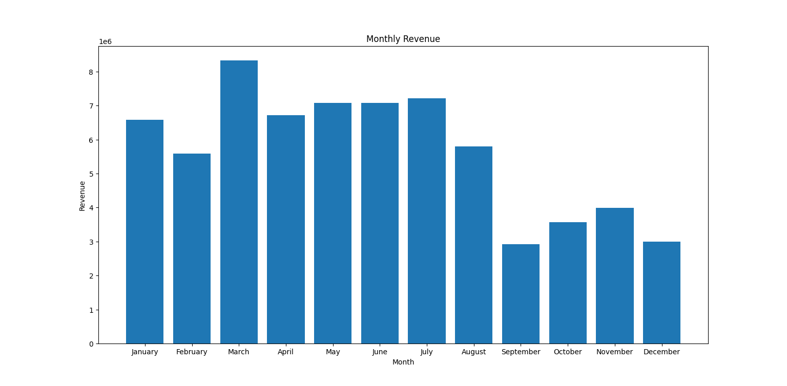
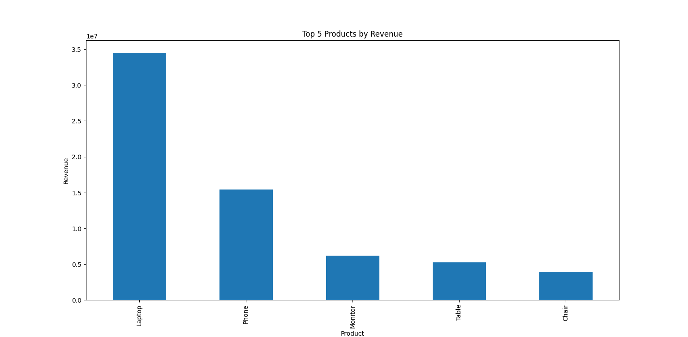
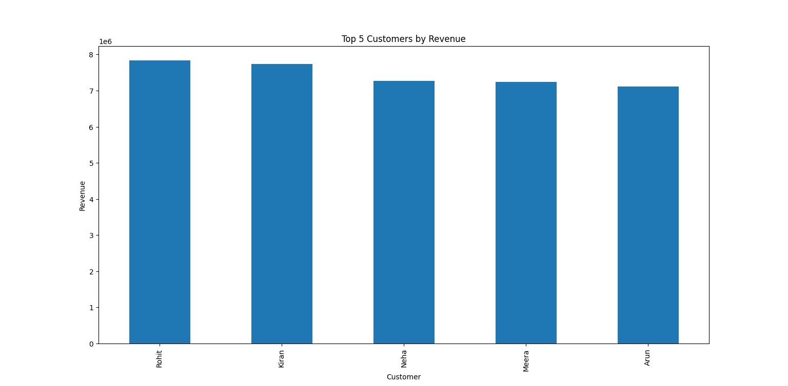
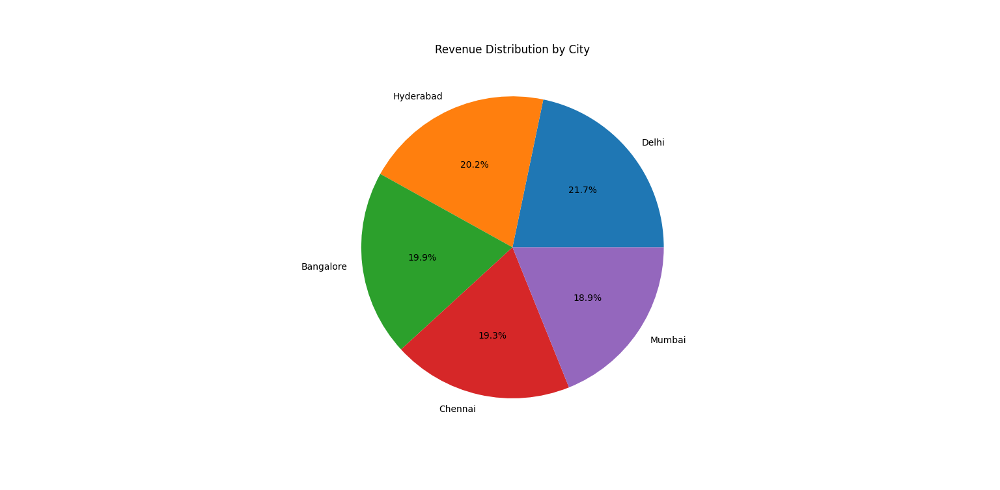

# 📊 Sales Data Analysis Project (Python)

## 🔹 Overview

This project analyzes sales data using Python to extract key business insights such as top customers, products, and monthly revenue trends.

## 🔹 Tech Stack

* Python
* Pandas
* Matplotlib

## 🔹 Key Analysis

* Top 5 customers by revenue 🏆
* Top 5 products by revenue 📦
* Top cities by revenue 🌍
* Monthly revenue trend 📈

## 🔹 Data Information

* The dataset used in this project is pre-cleaned.
* Analysis is performed directly on structured data.

## 🔹 Project Structure

* `scripts/` → analysis functions
* `requirements.txt` → dependencies

## 🔹 Key Functions

* `get_top_customers()`
* `get_top_products()`
* `get_top_cities()`
* `get_monthly_revenue()`
* `plot_monthly_revenue()`
* `plot_top_products()`
* `plot_top_customers()`
* `plot_city_revenue()`

## 🔹 How to Run

```bash
pip install -r requirements.txt
python main.py
```

## 🔹 Visualizations

### 📈 Monthly Revenue



### 📦 Top Products



### 🏆 Top Customers



### 🌍 Revenue by City



## 🔹 Output

* Displays top customers, products, and cities
* Generates multiple visualizations using bar and pie charts

## 🔹 Author

Chaitanya
